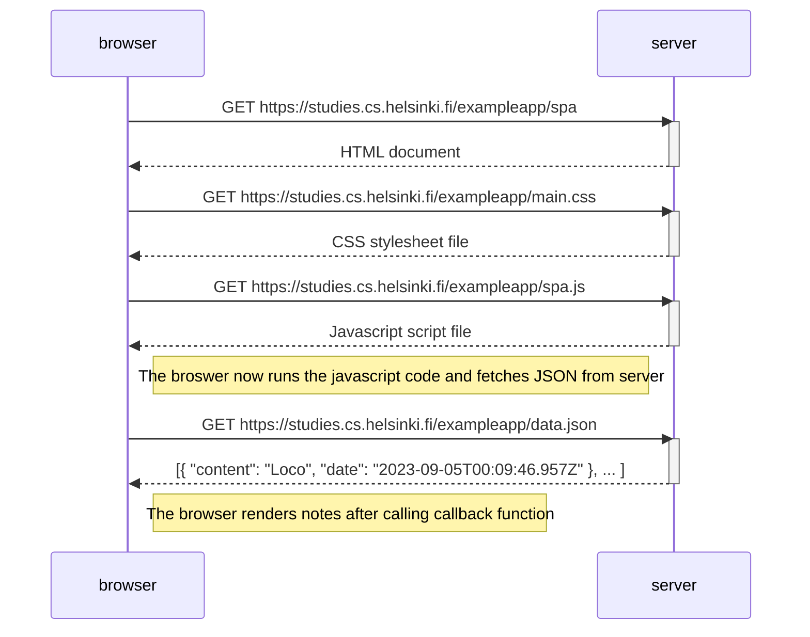

```mermaid
sequenceDiagram
    participant browser
    participant server

    browser->>server: GET https://studies.cs.helsinki.fi/exampleapp/spa
    activate server
    server-->>browser: HTML document
    deactivate server

    browser->>server: GET https://studies.cs.helsinki.fi/exampleapp/main.css
    activate server
    server-->>browser: CSS stylesheet file
    deactivate server

    browser->>server: GET https://studies.cs.helsinki.fi/exampleapp/spa.js
    activate server
    server-->>browser: Javascript script file
    deactivate server

    Note right of browser: The broswer now runs the javascript code and fetches JSON from server

    browser->>server: GET https://studies.cs.helsinki.fi/exampleapp/data.json
    activate server
    server-->>browser: [{ "content": "Loco", "date": "2023-09-05T00:09:46.957Z" }, ... ]
    deactivate server

    Note right of browser: The browser renders notes after calling callback function

```
