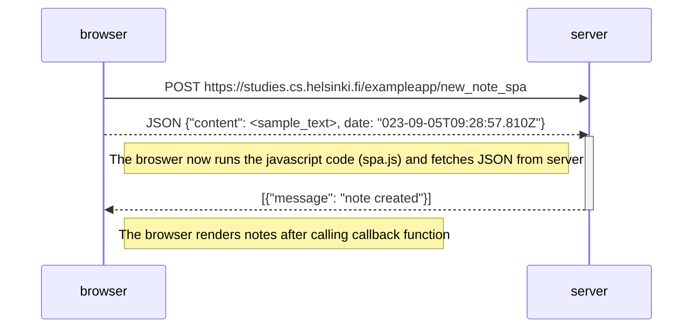

```mermaid
sequenceDiagram
    participant browser
    participant server

    browser->>server: POST https://studies.cs.helsinki.fi/exampleapp/new_note_spa 
    browser-->>server: JSON {"content": <sample_text>, date: "023-09-05T09:28:57.810Z"}
    
    activate server

    Note right of browser: The broswer now runs the javascript code (spa.js) and fetches JSON from server

    server-->>browser: [{"message": "note created"}]
    deactivate server

    Note right of browser: The browser renders notes after calling callback function

```
